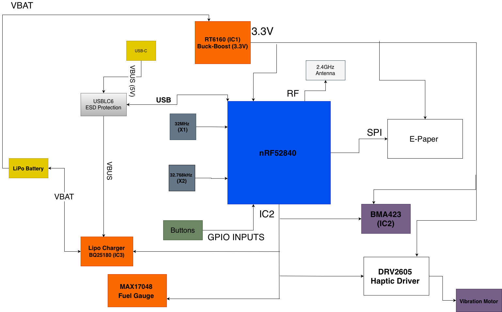
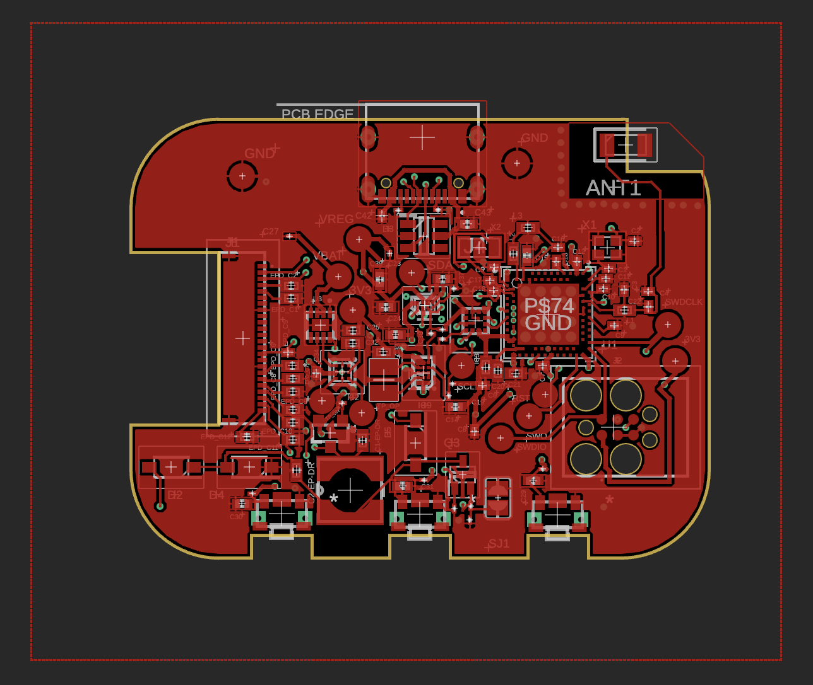
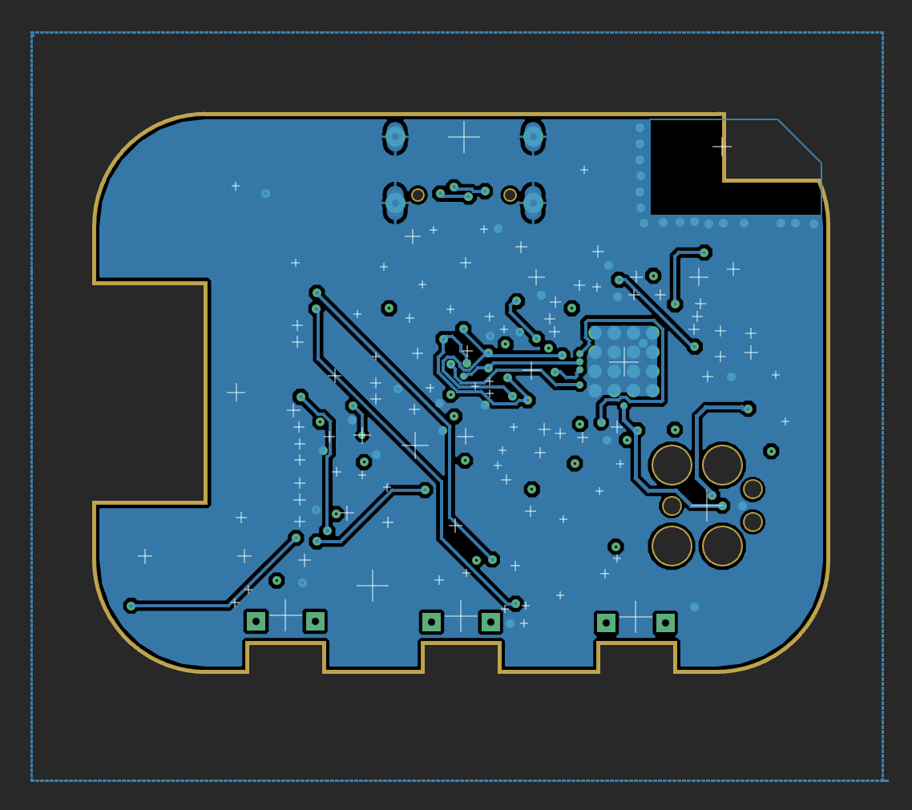
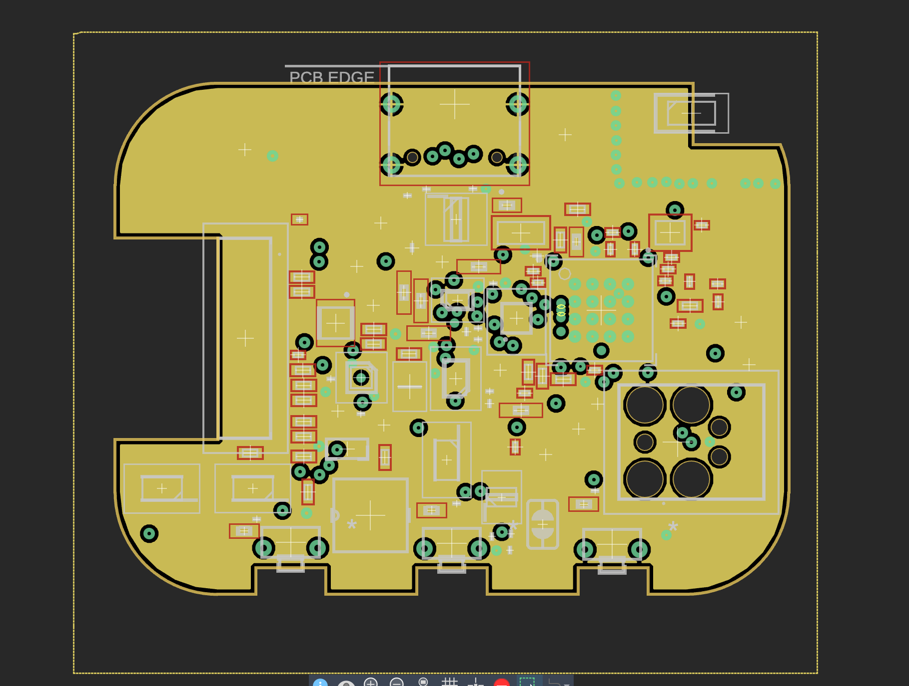
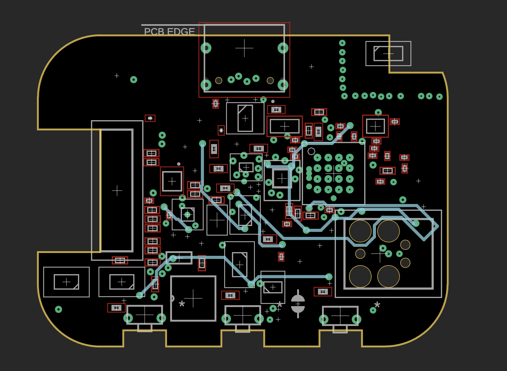
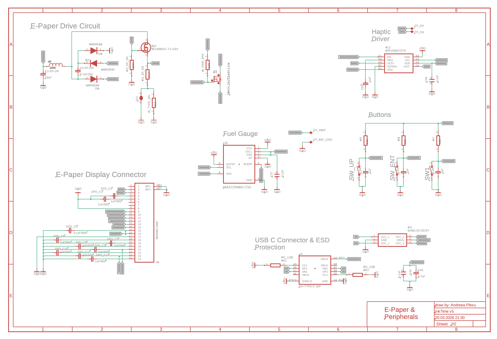
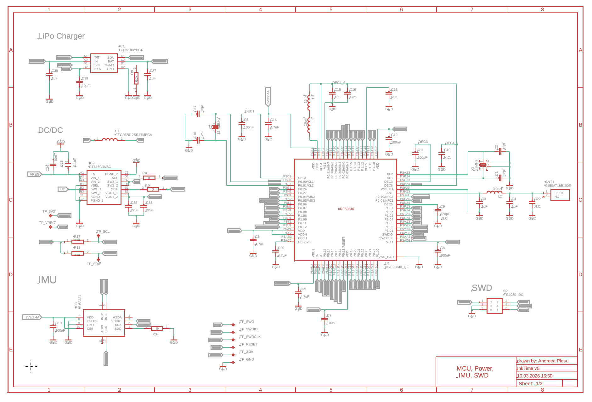

# SmartWatch InkTime 

Proiect de dezvoltare a unui ceas inteligent bazat pe microcontrolerul Nordic nRF52840, echipat cu un afișaj E-Ink și senzori pentru monitorizarea activității.

---

## Diagramă Bloc

---
Acest proiect reprezintă o platformă open-hardware de tip smartwatch, proiectată pentru flexibilitate maximă și eficiență energetică ridicată. Construit în jurul microcontrolerului nRF52840 , dispozitivul este complet compatibil cu mediile de dezvoltare C/C++, oferind control total la nivel de regiștri pentru proiecte embedded avansate.

- **[nRF52840](https://www.nordicsemi.com/Products/nRF52840)(Microcontroler):** System on Chip bazat pe ARM Cortex-M4F tactat la 64 MHz. Include suport nativ pentru Bluetooth 5 / BLE și radio 2.4 GHz. Dispune de 1 MB Flash și 256 KB RAM și oferă interfețe versatile: SPI, I2C, UART și GPIO pentru comunicarea cu celelalte module.
- **[E-Paper 1.54"](https://www.waveshare.com/wiki/1.54inch_e-Paper_Module):** Ecran cu consum redus de energie, rezoluție 200x200 pixeli, comunică cu MCU-ul prin interfața SPI.
- **[BQ25180](https://www.ti.com/product/BQ25180)(Încărcător LiPo):** IC pentru încărcarea bateriei Li-Ion/Li-Po, controlat prin I2C. Gestionează alimentarea de 5V de la portul USB și oferă funcții de *power path management*.
- **[MAX17048](https://www.analog.com/en/products/max17048.html)(Fuel Gauge):** Cip pentru monitorizarea precisă a nivelului bateriei (State-of-Charge).
- **[RT6160](https://www.richtek.com/Products/Switching%20Regulators/Buck-Boost%20Converter/RT6160)(Regulator Buck-Boost):** Reglează tensiunea bateriei pentru a furniza o ieșire stabilă de 3.3V necesară componentelor sistemului.
- **Baterie LiPo (250 mAh):** Sursa principală de energie a dispozitivului.
- **[USBLC6-2](https://www.st.com/en/protections-and-safety/usblc6-2.html) (Protecție USB):** Protecție ESD (Electrostatic Discharge) pentru portul USB-C, prevenind deteriorarea componentelor interne.
- **[BMA423](https://www.bosch-sensortec.com/products/motion-sensors/accelerometers/bma423/):** Senzor MEMS pe 3 axe, ultra-low-power, optimizat pentru wearables, oferind funcții integrate precum numărarea pașilor, recunoașterea activității și detectarea mișcării prin întreruperi.
- **[DRV2605L](https://www.ti.com/product/DRV2605L) (Driver Haptic):** Driver controlat prin I2C pentru motorul de vibrații.
- [FIT0774](https://www.dfrobot.com/product-2264.html): Shaker
-  **[TC2030-IDC](https://www.tag-connect.com/product/tc2030-idc/)**: Conector programare SWD.
- **Cristale de tact:**
  - **[32 MHz (X1)](https://www.digikey.ro/en/products/detail/abracon-llc/ABM8G-32.000MHZ-18-D2Y-T/2269926):** Asigură frecvența principală de operare pentru MCU.
  - **[32.768 kHz (X2)](https://www.digikey.ro/en/products/detail/epson/FC-135-32.7680KA-A3/4522301):** Folosit pentru ceasul de timp real (RTC) și menținerea acurateței temporale.

## Bill of Materials (BOM)

Aceasta este lista principală de componente pentru proiectul smartwatch-ului bazat pe nRF52840.

| Component | Descriere | Cantitate | Producător | Cod Piesă | Datasheet |
| :--- | :--- | :---: | :--- | :--- | :---: |
| **nRF52840** | BLE Microcontroller | 1 | Nordic Semiconductor | nRF52840 | [Link](https://files.seeedstudio.com/wiki/XIAO-BLE/Nano_BLE_MCU-nRF52840_PS_v1.1.pdf) |
| **BMA423** | Accelerometru 3-axe (IMU) | 1 | Bosch | BMA423 | [Link](https://watchy.sqfmi.com/assets/files/BST-BMA423-DS000-1509600-950150f51058597a6234dd3eaafbb1f0.pdf) |
| **BQ25180** | Încărcător baterie / PMIC | 1 | Texas Instruments | BQ25180 | [Link](https://www.ti.com/product/BQ25180) |
| **DRV2605L** | Driver haptic | 1 | Texas Instruments | DRV2605L | [Link](https://www.ti.com/product/BQ25180) |
| **MAX17048** | Fuel gauge | 1 | Analog Devices | MAX17048G+T10 | [Link](https://www.analog.com/en/products/max17048.html) |
| **RT6160** | Buck-boost converter | 1 | Richtek | RT6160AWSC | [Link](https://www.mouser.com/datasheet/2/1458/DS6160A_02-3104604.pdf) |
| **2450AT18B100E** | Antenă chip 2.4GHz | 1 | Johanson Technology | 2450AT18B100E | [Link](https://jlcpcb.com/api/file/downloadByFileSystemAccessId/8588940948130156544) |
| **TC2030-IDC** | Conector programare | 1 | Tag-Connect | TC2030-IDC | [Link](https://www.lcsc.com/datasheet/C5444772.pdf) |
| **USB-C Connector** | Interfață alimentare/date | 1 | Kinghelm | KH-TYPE-C-16P | [Link](https://jlcpcb.com/api/file/downloadByFileSystemAccessId/8588905154556923904) |
| **FPC Connector** | Conector display e-paper | 1 | Molex | 503480-2400 | [Link](https://www.molex.com/content/dam/molex/molexdotcom/products/automated/enus/salesdrawingpdf/503/503480/5034802400_sd.pdf?inline) |
| **Push Buttons** | Switch-uri tactile | 3 | Panasonic | EVP-AKE31A | [Link](https://wmsc.lcsc.com/wmsc/upload/file/pdf/v2/lcsc/2301111010_PANASONIC-EVPAKE31A_C569760.pdf) |
| **MOSFETs** | Comutare putere | 2 | Vishay / Diodes Inc. | SI1308EDL / DMG2305UX | [Link](https://www.lcsc.com/datasheet/C469327.pdf) |
| **Diodes** | Diode Schottky | 3 | ON Semiconductor | MBR0530 | [Link](https://www.lcsc.com/datasheet/C77336.pdf) |
| **ESD Protection** | Protecție USB | 1 | STMicroelectronics | USBLC6-2SC6 | [Link](https://www.lcsc.com/datasheet/C7519.pdf) |
| **Crystal** | 32MHz | 1 | NDK | NX2016SA-32MHZ-EXS00A-CS11336 | [Link](https://wmsc.lcsc.com/wmsc/upload/file/pdf/v2/lcsc/2312080231_NDK-NX2016SA-32MHZ-EXS00A-CS11336_C6134317.pdf) |
| **Crystals** | 32.768kHz | 1 | Seiko Epson | FC-135 32.7680KA-A3 | [Link](https://jlcpcb.com/partdetail/SeikoEpson-FC_135_32_7680KAA3/C2650472) |

---

##  Arhitectură și Specificații Hardware

### 1. Unitatea de Procesare (CPU)
* **Microcontroler:** **nRF52840 (Nordic Semiconductor)**
    * **Arhitectură:** ARM Cortex-M4F (cu FPU), tactat la 64 MHz.
    * **Capabilități:** Suport nativ Bluetooth 5.4 (BLE), radio 2.4 GHz.
    * **Memorie:** 1 MB Flash, 256 KB RAM.
    * **Rol:** Procesare centrală, gestionarea stivei Bluetooth și coordonarea perifericelor.

### 2. Sistemul de Management al Energiei (PMU)
Sistemul utilizează un lanț de alimentare eficient pentru a prelungi durata de viață a bateriei:

* **Încărcare (PMIC):** **BQ25180**
    * Gestionează alimentarea de 5V (USB-C) și oferă protecție integrată.
* **Reglare Tensiune:** **RT6160 (Buck-Boost)**
    * Converteste tensiunea bateriei (3.0V - 4.2V) la o linie stabilă de **3.3V** cu o eficiență de peste 90%.
* **Monitorizare:** **MAX17048 (Fuel Gauge)**
    * Algoritm *ModelGauge* pentru estimarea precisă a nivelului bateriei.
 
 ### 3. Matricea de Comunicare
Sistemul utilizează magistrale digitale pentru a minimiza numărul de pini ocupați:

| Protocol | Componente Conectate | Funcție |
| :--- | :--- | :--- |
| **SPI** | E-Paper Display | Transfer rapid de pixeli pentru refresh. |
| **I2C** | BMA423, BQ25180, DRV2605L, MAX17048 | Magistrală partajată pentru senzori și PMU. |
| **GPIO** | Butoane fizice, Interrupts (BMA423) | Input utilizator și wake-up trigger. |
| **SWD** | Conector TC2030-IDC | Interfață de programare și debugging. |

### 4. Periferice 
* **Afișaj:** E-Paper 1.54" (200x200).
    * *Avantaj:* Consum de energie zero pentru menținerea imaginii (bistabil).
* **Senzor:** **BMA423 (Accelerometru)**.
    * *Rol:* Detecția pașilor, recunoașterea activității și trezirea MCU-ului din `Deep Sleep`.
* **Feedback Haptic:** **DRV2605L** + Motor vibrații.
    * *Rol:* Driver haptic inteligent pentru feedback tactil avansat (click-uri, alerte), controlat via I2C.

---

## 4. Mapare Pini nRF52840

| Pin nRF52840 | Semnal | Componentă | Interfață |
| :--- | :--- | :--- | :--- |
| **P0.00** | XL1 | Cristal X2 (32.768kHz) | XTAL |
| **P0.01** | XL2 | Cristal X2 (32.768kHz) | XTAL |
| **P0.02** | SCK | E-Paper (J1 FPC) | SPI SCK |
| **P0.03** | MOSI | E-Paper (J1 FPC) | SPI MOSI |
| **P0.05** | EPD_CS | E-Paper (J1 FPC) | SPI CS |
| **P0.06** | SDA | BMA423, BQ25180, MAX17048, DRV2605 | I2C SDA |
| **P0.07** | SCL | BMA423, BQ25180, MAX17048, DRV2605 | I2C SCL |
| **P0.08** | IMU_INT1 | BMA423 | GPIO Input |
| **P1.08** | IMU_INT2 | BMA423 | GPIO Input |
| **P0.10** | ALERT | MAX17048 | GPIO Input |
| **P0.11** | PMIC_INT | BQ25180 | GPIO Input |
| **P0.12** | HAPTIC_EN | DRV2605 | GPIO Output |
| **P0.13** | SW_UP | Buton Up | GPIO Input |
| **P0.14** | SW_ENT | Buton Enter | GPIO Input |
| **P0.15** | EPD_DC | E-Paper (J1 FPC) | GPIO |
| **P0.16** | EPD_RST | E-Paper (J1 FPC) | GPIO |
| **P0.17** | EPD_BUSY | E-Paper (J1 FPC) | GPIO Input |
| **P0.18** | RESET | TC2030-IDC | SWD / Reset |
| **P1.02** | SW_DN | Buton Down | GPIO Input |
| **SWDCLK** | SWDCLK | TC2030-IDC | SWD |
| **SWDIO** | SWDIO | TC2030-IDC | SWD |
| **ANT** | RF | Antenă 2450AT18B100E | RF |

---
## 5. Specificații Design PCB

### Reguli de Proiectare 
* **Strat 1 (Top):** Componente și rutare semnal.
* **Strat 2 (Internal):** Plan Putere (VCC/3V3).
* **Strat 3 (Internal):** Plan Masă (GND).
* **Strat 4 (Bottom):** Rutare semnal și componente.

### Constrângeri DRC
* **Trasee Putere:** 0.3 mm (îngustate sub BGA).
* **Trasee Date:** 0.15 mm (min).
* **Unghiuri:** Doar 45° sau rotunjite.
* **Antenă:** Zonă "Keep-out" (fără cupru) pe toate straturile sub antenă.
* **Decuplare:** Condensatoarele de 100nF plasate direct pe pinii de alimentare.

### Erori DRC Acceptate
* **Copper Clearance (Aprobat):** În zona fan-out-ului pentru nRF52840, clearance-ul a fost redus manual sub 0.15mm pentru a permite rutarea corectă a pinilor AQFN cu pitch mic.

---

### Design PCB
| Top Layer | Bottom Layer |
|:---:|:---:|
|  |  |
| **Inner Layer GND** | **Inner Layer Signal** |
|  |  |

### Design Schematic
---

| Pagina 1 - MCU & Power | Pagina 2 - Display & Senzori |
|:---:|:---:|
|  |  |

---
## 6. Structură Repository
* `Hardware/` - Fișierele sursă `.sch` și `.brd` (Autodesk Fusion/Eagle).
* `Manufacturing/` - Fișiere Gerber, BOM și Pick & Place.
* `Mechanical/` - Modelul 3D al dispozitivului în format `.f3d` și `.step`.
* `Images/` - Randări și screenshot-uri ale proiectului.
